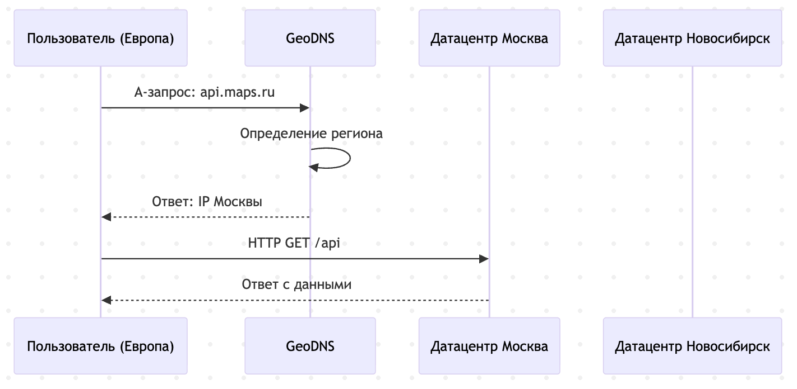
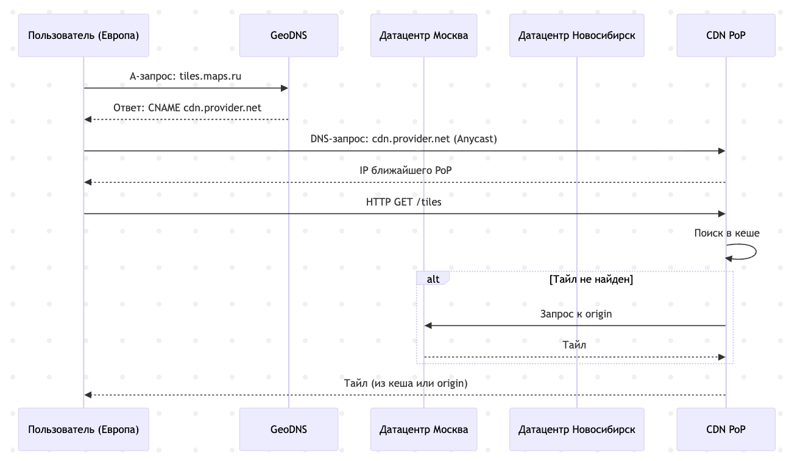

# Расчетно-пояснительная записка
## 1. Тема и целевая аудитория
## Описание темы
**Проектируемый сервис:** Картографический сервис с навигацией и поиском организаций
### Описание целевой аудитории
**Местоположение аудитории:** Российская Федерация
**Размер аудитории:** ~100 млн. в месяц

**Обоснование:**
* **Яндекс карты**: более 90 млн. пользователей за сентябрь 2025[1](#Список-источников)
* **Google Maps**: более 2 млрд. пользователей в месяц на конец 2024[2](#Список-источников)
* **2ГИС**: более 70 млн. пользователей в месяц[3](#Список-источников)

### Функциональные требования
#### Ключевой функционал
* Отображение карты
* Поиск мест по адресу или названию организации
* Сохранение избранных мест
* Построение маршрутов

#### Ключевые продуктовые решения
* Визуализация происходит на основе векторных тайлов, кешируемых на клиенте
* Для построения маршрутов используются предрассчитанные графы дорог
* Для поиска используется поисковый движок (Elasticsearch?), поддерживающий гео-фильтрацию. Популярные запросы кэшируются
* Избранные места привязываются к аккаунту пользователя и приоритизируются в поиске

## 2. Расчет нагрузки

### Продуктовые метрики
#### Сводная таблица
| Метрика                                         |    Значение     |                                                      Источник                                                       |
| :---------------------------------------------- | :-------------: | :-----------------------------------------------------------------------------------------------------------------: |
| MAU                                             | 90 млн. человек |                                               [1](#Список-источников)                                               |
| DAU                                             | 18 млн. человек |                                              [Расчет DAU](#Расчет-DAU)                                              |
| Средний размер хранилища пользователя в шт.     |       221       |          [Расчет среднего размера хранилища пользователя](#Расчет-среднего-размера-хранилища-пользователя)          |
| Средний размер хранилища пользователя в Гб      |    132.02 МБ    |          [Расчет среднего размера хранилища пользователя](#Расчет-среднего-размера-хранилища-пользователя)          |
| Cреднее количество действий пользователя в день |       276       | [Расчет среднего количества действий пользователя в день](#Расчет-среднего-количества-действий-пользователя-в-день) |
| Cредняя протяженность сессии                    |     6 минут     | [Расчет среднего количества действий пользователя в день](#Расчет-среднего-количества-действий-пользователя-в-день) |

#### Расчет DAU
Точное значение количества ежедневных пользователей в открытых источниках найти не удалось. Выполним его оценку на основе коэффициента липучести[4](#Список-источников), который в случае приложений-утилит в среднем равен 20%:

$$
SF=\frac{DAU}{MAU}=20\%
$$

$$
DAU=SF * MAU = 0.2 * 90\ млн.\ человек = 18\ млн.\ человек
$$

#### Расчет среднего размера хранилища пользователя
Для каждого пользователя сохраняются избранные места и история поиска Также локально может сохраняться сама карта, состоящая из тайлов карт и геометок объектов на ней.
Предположим, что в среднем пользователи имеют около 10 избранных мест, каждая запись является идентификатором объекта на карте и занимает порядка 100 байт.
В истории поиска сохраняются последние 200 запросов, это также идентификаторы объектов на карте.
В приложении Яндекс карт[5](#Список-источников) можно просмотреть размер загружаемых офлайн-карт для разных городов. Полная карта Москвы займет 658 МБ, Санкт-Петербурга - 345 МБ. Для городов миллионников, таких как Казань или Нижний Новгород, значение в среднем составляет 125 МБ. Для менее крупных городов, 70 МБ. 
Распределение населения РФ[6](#Список-источников):
Москва: 13 млн. человек
Санкт-Петербург: 5.5 млн. человек
Города-миллионники: 20 млн. человек [7](#Список-источников)
Остальные регионы: 83 млн. человек

$$
Средний\ размер\ сохраняемой\ карты= \frac{13\times658+5.5\times345+20\times125+83\times70}{146}=137\ МБ
$$

| Тип хранимых данных | Среднее количество | Размер записи | Объем хранилища |
| :------------------ | :----------------: | :-----------: | :-------------: |
| Избранные места     |         20         |   100 байт    |      2 Кб       |
| История поиска      |        200         |   100 байт    |      20 Кб      |
| Офлайн карта        |         1          |    132 МБ     |     132 МБ      |
| Все данные          |        221         |       -       |    132.02 МБ    |

#### Расчет среднего количества действий пользователя в день
Каждая сессия пользователя в приложении состоит из последовательности действий и, как правило, следует структуре:
Просмотр карты --> Поиск организации --> Построение маршрута --> Следование маршруту
Оценим, как часто пользователи полностью проходят этот цикл:
Согласно отчету Яндекс, за 2025 год пользователи построили 6.5 млрд. маршрутов[8](#Список-источников). Исходя из этого, оценим число маршрутов в день:

$$
Маршрутов\ в\ день\ =\frac{Daily\ Routes}{DAU} =\frac{\frac{Yearly\ Routes}{365}}{DAU} = \frac{\frac{6.500.000.000}{365}}{18.000.000} \approx 1
$$

Поскольку не всегда поиск организации приводит к построению маршрута, предположим, что поисков в среднем происходит вдвое больше, 2 в день.

Эмпирически оценим число запросов на загрузку тайлов карты. При открытии веб-версии яндекс карт, сразу выполняется около 20 HTTP запросов на получение тайлов. При перемещении карты с полной заменой видимой области, также около 20 запросов. Изменение масштаба на один уровень - 30 запросов.

Уже оценено, что в день в среднем происходит одна сессия. Рассмотрим её возможную структуру для оценки времени и числа запросов загрузки тайлов:
1. Быстрый запрос, 1-3 минуты: Пользователь открывает карту, ищет место, примерно смотрит расположение и покидает приложение.
Стартовая загрузка - 20 запросов
1-2 зума для выбора района - 45 запросов
5-7 прокруток - 120 запросов
Итого: 185 запросов
2. Сравнение вариантов, 3-7 минут: Пользователь открывает карту, проверяет разные варианты мест, сравнивает их, возможно строит маршрут чтобы оценить расстояние.
Стартовая загрузка - 20 запросов
3-7 зума для выбора района - 150 запросов
15-21 прокруток - 180 запросов
Итого: 350 запросов
1. Навигация, 30-40 минут: Пользователь открывает карту, ищет место, строит маршрут и продолжает использовать приложение как автомобильный навигатор, периодически изменяя масштаб.
Стартовая загрузка - 20 запросов
При выборе маршрута:
1-2 зума для выбора района - 45 запросов
5-7 прокруток - 120 запросов
По ходу движения:
2-4 зума для оценки оставшегося расстояния - 90 запросов
10-20 прокруток в фоне по ходу продвижения - 300 запросов
Итого: 575 запросов

Предположим, что 60% сессий будут быстрыми, 30% сравнительными, 10% навигационными. Тогда, средняя протяженность сессии:

$$
T_{avg}=0.6\times T_{1} + 0.3\times T_{2} + 0.1\times T_{3} = 0.6\times 2 + 0.3\times 5 + 0.1\times 35 \approx 6\ минут
$$

Среднее число запросов

$$
Requests_{avg}=0.6\times Requests_{1} + 0.3\times Requests_{2} + 0.1\times Requests_{3} = 0.6\times 185 + 0.3\times 350 + 0.1\times 575 \approx 273\ запроса
$$

Тогда, всего действий:
| Поиск организации | Построение маршрута | Загрузка тайлов | Всего |
| :---------------: | :-----------------: | :-------------: | :---: |
|         2         |          1          |       273       |  276  |
### Технические метрики

#### Размер хранения
В описании API Яндекс карт[9](#Список-источников) указано, что тайлы являются PNG-файлами 256x256 пикселей, причем на каждом этапе масштабирования карта разбита на 4z тайлов, где z - уровень масштабирования. Эмпирически через просмотр структуры запросов на получение тайлов определим, что максимальное значение z равно 20. Тогда, общее число тайлов составляет:

$$
\sum_{z=0}^{20} 4^z = \frac{4^{21} - 1}{4 - 1} \approx 1.466.015.500.000
$$

Эмпирически через запросы к API Яндекс Карт определено, что размер тайла составляет от 3 до 300 Кб, в зависимости от детализации конкретной области. Возьмем 40 Кб за среднее значение. Тогда, полная карта для хранения потребует:

$$
1.466.015.500.000 \times 40\ Кбайт \approx 58.64\ Пбайт
$$

На основе доступных выгрузок OpenStreetMap[10](#Список-источников), размер графа дорог составит ~90 Гбайт

На основе публичных данных поиска по организациям Яндекс Карт[11](#Список-источников), оценим их количество как 13 млн. Одна запись организации (Название, адрес, описание) в json ~300 байт. С учетом inverted index ElasticSearch, размер вырастет до ~600 байт. Итого для данных об организациях:

$$
13.000.000 \times 600\ байт = 7.8\ Гбайт
$$

Тогда, всего данных:
|    Карты    | Графы дорог | Организации |    Всего    |
| :---------: | :---------: | :---------: | :---------: |
| 58.64 Пбайт |  90 Гбайт   |  7.8 Гбайт  | 59.62 Пбайт |

#### Сетевой трафик
На основе предыдущих оценок, в день на пользователя имеем 2 запроса на поиск организации, 1 запрос на построение маршрута и 273 на загрузку тайлов. Пересчитаем для трафика в секунду. На основе запросов к API Яндекс Карт, в среднем запрос на построение маршрута: 300 Кбайт, запрос на поиск организации: 20 Кбайт, запрос на тайлы: 40 Кбайт. Тогда, среднее на пользователя в день:

| Поиск организации | Построение маршрута | Загрузка тайлов |    Всего    |
| :---------------: | :-----------------: | :-------------: | :---------: |
|     40 Кбайт      |      300 Кбайт      |   10,92 Мбайт   | 11,26 Мбайт |

Переведем в Гбит/с для всех пользователей. Для пикового потребления возьмем типовой коэффициент 2,5.

$$
V_{\text{total}} = \text{DAU} \times V_{\text{user}} = 18.000.000 \times 11,26 \ Мбайт = 202680 \ Гбайт
$$

$$
V_{\text{avg}} = \frac{V_{\text{total}}}{86400 \ секунд} \approx 18,7\ Гбит/с
$$

$$
V_{\text{peak}} = V_{\text{avg}} \times 2,5 = 46,75\ Гбит/с
$$

| Пиковое потребление | Среднее потребление | Суммарное суточное потребление |
| :-----------------: | :-----------------: | :----------------------------: |
|    46,75 Гбит/с     |     18,7 Гбит/с     |          202680 Гбайт          |

### RPS
На основе полученных ранее среднесуточных действий для пользователя:
| Поиск организации | Построение маршрута | Загрузка тайлов | Всего |
| :---------------: | :-----------------: | :-------------: | :---: |
|         2         |          1          |       273       |  276  |

$$
RPS_{\text{i}} = \frac{DAU \times Requests_{\text{i}}}{86400 \ секунд}
$$

| Действие            | RPS в среднем | RPS пиковый | Запросов в сутки |
| :------------------ | :-----------: | :---------: | :--------------: |
| Поиск организации   |      416      |    1040     |    35 942 400    |
| Построение маршрута |      208      |     520     |    17 971 200    |
| Загрузка тайлов     |    56 875     |   142 188   |  4 914 000 000   |
| Всего               |    57 499     |   143 748   |  4 967 913 600   |

## 3. Глобальная балансировка нагрузки
### Функциональное разбиение по доменам
|       Функция       |     Домен     |
| :-----------------: | :-----------: |
|  Поиск организации  |  api.maps.ru  |
| Построение маршрута |  api.maps.ru  |
|   Загрузка тайлов   | tiles.maps.ru |

### Обоснование расположения ДЦ
Предполагается использовать два дата-центра, в Москве и Новосибирске, и CDN для доставки тайлов карты. Порядка 70% населения России проживает в её европейской части, 20% - в Сибири[11](#Список-источников), поэтому такое расположение позволит минимизировать задержки для пользователей и обеспечит сохранение доступности сервиса при сбое на одном из датацентров.

#### Влияние на продуктовые метрики
**DAU**: Использование второго дата-центра в Новосибирске снизит задержки для 30% жителей России, что расширяет потенциальную аудиторию до полного населения страны.
**Доступность сервиса**: При отказе одного из датацентров трафик перенаправляется в другой. Задержки для части пользователей возрастут, но сервис сохранит работоспособность.

### Расчет распределения запросов по типам запросов по датацентрам
Исходя из географического распределения населения, предположим что 70% запросов уходят на датацентр в Москве, 30% на датацентр в Новосибирске.
| Действие                | RPS в среднем | RPS пиковый | Запросов в сутки  |
| :---------------------- | :-----------: | :---------: | :---------------: |
| **Поиск организации**   |               |             |                   |
| Москва                  |      291      |     728     |    25 159 680     |
| Новосибирск             |      125      |     312     |    10 782 720     |
| **Построение маршрута** |               |             |                   |
| Москва                  |      146      |     364     |    12 579 840     |
| Новосибирск             |      62       |     156     |     5 391 360     |
| **Загрузка тайлов**     |               |             |                   |
| CDN                     |    56 875     |   142 188   |   4 914 000 000   |
| **Всего**               |               |             |                   |
| Москва                  |      437      |    1 092    |    37 739 520     |
| Новосибирск             |      187      |     468     |    16 174 080     |
| CDN                     |    56 875     |   142 188   |   4 914 000 000   |
| **Итого по сервису**    |  **57 499**   | **143 748** | **4 967 913 600** |

### Схема DNS балансировки

### Схема Anycast балансировки

## Список источников
1. https://ir.yandex.ru/financial-releases (Q3 2025, Финансовый отчет МКПАО Яндекс)
2. https://abc.xyz/investor/events/event-details/2024/2024-q3-earnings-call/ (Q3 2024, Финансовый отчет Alphabet)
3. https://info.2gis.ru/novosibirsk/ (2025, Официальный сайт 2ГИС)
4. https://www.wallstreetprep.com/knowledge/product-stickiness/
5. https://yandex.ru/project/maps/app_download
6. https://ria.ru/20250226/goroda-1832007799.html
7. https://www.rbc.ru/life/news/65fbfb259a7947623baacfae
8. https://yandex.ru/company/news/23-12-2025-02
9. https://yandex.ru/maps-api/docs/tiles-api/index.html?utm_campaign=links&utm_content=api-translate&utm_source=emailing
10. https://download.geofabrik.de/
11. https://yandex.ru/maps-api/products/geosearch-api?utm_campaign=links&utm_content=api-translate&utm_source=emailing&lang=ru
12. https://xn--80apggvco.xn--p1ai/chislennost-naseleniya-rossii-po-regionam-2025