# Расчетно-пояснительная записка
## 1. Тема и целевая аудитория
## Описание темы
**Проектируемый сервис:** Картографический сервис с навигацией и поиском организаций
### Описание целевой аудитории
**Местоположение аудитории:** Российская Федерация
**Размер аудитории:** ~100 млн. в месяц

**Обоснование:**
* **Яндекс карты**: более 90 млн. пользователей за сентябрь 2025[1](#Список-источников)
* **Google Maps**: более 2 млрд. пользователей в месяц на конец 2024[2](#Список-источников)
* **2ГИС**: более 70 млн. пользователей в месяц[3](#Список-источников)

### Функциональные требования
#### Ключевой функционал
* Отображение карты
* Поиск мест по адресу или названию организации
* Сохранение избранных мест
* Построение маршрутов

#### Ключевые продуктовые решения
* Визуализация происходит на основе векторных тайлов, кешируемых на клиенте
* Для построения маршрутов используются предрассчитанные графы дорог
* Для поиска используется поисковый движок (Elasticsearch?), поддерживающий гео-фильтрацию. Популярные запросы кэшируются
* Избранные места привязываются к аккаунту пользователя и приоритизируются в поиске

## 2. Расчет нагрузки

### Продуктовые метрики
#### Сводная таблица
| Метрика                                         |    Значение     |                                                      Источник                                                       |
| :---------------------------------------------- | :-------------: | :-----------------------------------------------------------------------------------------------------------------: |
| MAU                                             | 90 млн. человек |                                               [1](#Список-источников)                                               |
| DAU                                             | 36 млн. человек |                                              [Расчет DAU](#Расчет-DAU)                                              |
| Средний размер хранилища пользователя в шт.     |       221       |          [Расчет среднего размера хранилища пользователя](#Расчет-среднего-размера-хранилища-пользователя)          |
| Средний размер хранилища пользователя в Гб      |    132.02 МБ    |          [Расчет среднего размера хранилища пользователя](#Расчет-среднего-размера-хранилища-пользователя)          |
| Cреднее количество действий пользователя в день |       276       | [Расчет среднего количества действий пользователя в день](#Расчет-среднего-количества-действий-пользователя-в-день) |
| Cредняя протяженность сессии                    |     6 минут     | [Расчет среднего количества действий пользователя в день](#Расчет-среднего-количества-действий-пользователя-в-день) |

#### Расчет DAU
Точное значение количества ежедневных пользователей в открытых источниках найти не удалось. Выполним его оценку на основе коэффициента липучести[4](#Список-источников), который в случае приложений для навигации в среднем равен 40%:

$$
SF=\frac{DAU}{MAU}=40\%
$$

$$
DAU=SF * MAU = 0.4 * 90\ млн.\ человек = 36\ млн.\ человек
$$

#### Расчет среднего размера хранилища пользователя
Для каждого пользователя сохраняются избранные места и история поиска с маршрутами.

| Тип хранимых данных | Среднее количество | Размер записи | Объем хранилища |
| :------------------ | :----------------: | :-----------: | :-------------: |
| Избранные места     |         20         |   100 байт    |      2 Кб       |
| История поиска      |        200         |   100 байт    |      20 Кб      |
| История маршрутов   |         50         |   200 байт    |      10 Кб      |
| Все данные          |        270         |       -       |      32 Кб      |

#### Расчет среднего количества действий пользователя в день
Каждая сессия пользователя в приложении состоит из последовательности действий и, как правило, следует структуре:
Просмотр карты --> Поиск организации --> Построение маршрута --> Следование маршруту
Оценим, как часто пользователи полностью проходят этот цикл:
Согласно отчету Яндекс, за 2025 год пользователи построили 6.5 млрд. маршрутов[8](#Список-источников). Исходя из этого, оценим число маршрутов в день:

$$
Маршрутов\ в\ день\ =\frac{Daily\ Routes}{DAU} =\frac{\frac{Yearly\ Routes}{365}}{DAU} = \frac{\frac{6.500.000.000}{365}}{36.000.000} \approx 0.5
$$

Поскольку не всегда поиск организации приводит к построению маршрута, предположим, что поисков в среднем происходит вдвое больше, 1 в день. Поиск приводит к загрузке

Эмпирически оценим число запросов на загрузку тайлов карты. При открытии веб-версии яндекс карт, сразу выполняется около 20 HTTP запросов на получение тайлов. При перемещении карты с полной заменой видимой области, также около 20 запросов. Изменение масштаба на один уровень - 30 запросов.

Уже оценено, что в день в среднем происходит одна сессия. Рассмотрим её возможную структуру для оценки времени и числа запросов загрузки тайлов:
1. Быстрый запрос, 1-3 минуты: Пользователь открывает карту, ищет место, примерно смотрит расположение и покидает приложение.
Стартовая загрузка - 20 запросов
1-2 зума для выбора района - 45 запросов
5-7 прокруток - 120 запросов
Итого: 185 запросов
2. Сравнение вариантов, 3-7 минут: Пользователь открывает карту, проверяет разные варианты мест, сравнивает их, возможно строит маршрут чтобы оценить расстояние.
Стартовая загрузка - 20 запросов
3-7 зума для выбора района - 150 запросов
15-21 прокруток - 180 запросов
Итого: 350 запросов
1. Навигация, 30-40 минут: Пользователь открывает карту, ищет место, строит маршрут и продолжает использовать приложение как автомобильный навигатор, периодически изменяя масштаб.
Стартовая загрузка - 20 запросов
При выборе маршрута:
1-2 зума для выбора района - 45 запросов
5-7 прокруток - 120 запросов
По ходу движения:
2-4 зума для оценки оставшегося расстояния - 90 запросов
10-20 прокруток в фоне по ходу продвижения - 300 запросов
Итого: 575 запросов

Предположим, что 60% сессий будут быстрыми, 30% сравнительными, 10% навигационными. Тогда, средняя протяженность сессии:

$$
T_{avg}=0.6\times T_{1} + 0.3\times T_{2} + 0.1\times T_{3} = 0.6\times 2 + 0.3\times 5 + 0.1\times 35 \approx 6\ минут
$$

Среднее число запросов

$$
Requests_{avg}=0.6\times Requests_{1} + 0.3\times Requests_{2} + 0.1\times Requests_{3} = 0.6\times 185 + 0.3\times 350 + 0.1\times 575 \approx 273\ запроса
$$

Тогда, всего действий:
| Поиск организации | Построение маршрута | Загрузка тайлов | Всего |
| :---------------: | :-----------------: | :-------------: | :---: |
|         1         |         0.5         |       273       | 274.5 |
### Технические метрики

#### Размер хранения
В описании API Яндекс карт[9](#Список-источников) указано, что тайлы являются PNG-файлами 256x256 пикселей, причем на каждом этапе масштабирования карта разбита на 4z тайлов, где z - уровень масштабирования. Эмпирически через просмотр структуры запросов на получение тайлов определим, что максимальное значение z равно 18. Тогда, общее число тайлов составляет:

$$
\sum_{z=0}^{20} 4^z = \frac{4^{21} - 1}{4 - 1} \approx 91.625.969.000
$$

Эмпирически через запросы к API Яндекс Карт определено, что размер тайла составляет от 3 до 300 Кб, в зависимости от детализации конкретной области. Возьмем 40 Кб за среднее значение. Тогда, полная карта для хранения потребует:

$$
1.466.015.500.000 \times 40\ Кбайт \approx 3.67\ Пбайт
$$

На основе доступных выгрузок OpenStreetMap[10](#Список-источников), размер графа дорог составит ~90 Гбайт

На основе публичных данных поиска по организациям Яндекс Карт[11](#Список-источников), оценим их количество как 13 млн. Одна запись организации (Название, адрес, описание) в json ~300 байт. Возьмем также 10 изображений по 200 Кбайт. С учетом inverted index ElasticSearch, размер вырастет до ~600 байт. Итого для данных об организациях:

$$
13.000.000 \times 600\ байт = 7.8\ Гбайт
$$

$$
13.000.000 \times 10 \times 200\ Кбайт = 26\ Тбайт
$$

Тогда, всего данных:
|    Карты    | Графы дорог | Организации (данные) | Организации (изображения) |    Всего    |
| :---------: | :---------: | :------------------: | :-----------------------: | :---------: |
| 3.67 Пбайт |  90 Гбайт   |      7.8 Гбайт       |         26 Тбайт          | 3.69 Пбайт |

#### Сетевой трафик
На основе предыдущих оценок, в день на пользователя имеем 1 запрос на поиск организации, 0.5 запроса на построение маршрута и 273 на загрузку тайлов. Пересчитаем для трафика в секунду. На основе запросов к API Яндекс Карт, в среднем запрос на построение маршрута: 300 Кбайт, запрос на поиск организации: 20 Кбайт, запрос на тайлы: 40 Кбайт. Тогда, среднее на пользователя в день:

| Поиск организации | Построение маршрута | Загрузка изображений организаций | Загрузка тайлов |    Всего    |
| :---------------: | :-----------------: | :------------------------------: | :-------------: | :---------: |
|     20 Кбайт      |      150 Кбайт      |             2 Мбайт              |   10,92 Мбайт   | 13,26 Мбайт |

Переведем в Гбит/с для всех пользователей. Для пикового потребления возьмем типовой коэффициент 2,5.

$$
V_{\text{total}} = \text{DAU} \times V_{\text{user}} = 36.000.000 \times 13,26 \ Мбайт = 477360 \ Гбайт
$$

$$
V_{\text{avg}} = \frac{V_{\text{total}}}{86400 \ секунд} \approx 44,2\ Гбит/с
$$

$$
V_{\text{peak}} = V_{\text{avg}} \times 2,5 = 110,5\ Гбит/с
$$

| Пиковое потребление | Среднее потребление | Суммарное суточное потребление |
| :-----------------: | :-----------------: | :----------------------------: |
|    110,5 Гбит/с     |     44,2 Гбит/с     |          477360 Гбайт          |

### RPS
На основе полученных ранее среднесуточных действий для пользователя:
| Поиск организации | Построение маршрута | Загрузка изображений организации | Загрузка тайлов | Всего |
| :---------------: | :-----------------: | :------------------------------: | :-------------: | :---: |
|         1         |         0.5         |                10                |       273       | 274.5 |

$$
RPS_{\text{i}} = \frac{DAU \times Requests_{\text{i}}}{86400 \ секунд}
$$

| Действие                         | RPS в среднем | RPS пиковый | Запросов в сутки |
| :------------------------------- | :-----------: | :---------: | :--------------: |
| Поиск организации                |      416      |    1040     |    35 942 400    |
| Построение маршрута              |      208      |     520     |    17 971 200    |
| Загрузка изображений организации |     4160      |    10400    |   359 424 000    |
| Загрузка тайлов                  |    114 750    |   284 375   |  9 914 400 000   |
| Всего                            |    119 534    |   296 335   |  10 327 737 600  |

## 3. Глобальная балансировка нагрузки
### Функциональное разбиение по доменам
|             Функция              |     Домен      |
| :------------------------------: | :------------: |
|        Поиск организации         |  api.maps.ru   |
|       Построение маршрута        |  api.maps.ru   |
| Загрузка изображений организаций | images.maps.ru |
|         Загрузка тайлов          | tiles.maps.ru  |

### Обоснование расположения ДЦ
Предполагается использовать два дата-центра, в Москве и Новосибирске, и CDN для доставки тайлов карты. Порядка 70% населения России проживает в её европейской части, 20% - в Сибири[11](#Список-источников), поэтому такое расположение позволит минимизировать задержки для пользователей и обеспечит сохранение доступности сервиса при сбое на одном из датацентров.

#### Влияние на продуктовые метрики
**DAU**: Использование второго дата-центра в Новосибирске снизит задержки для 30% жителей России, что расширяет потенциальную аудиторию до полного населения страны.

**Доступность сервиса**: При отказе одного из датацентров трафик перенаправляется в другой. Задержки для части пользователей возрастут, но сервис сохранит работоспособность.

#### Сценарий отказов
В обоих датацентрах реализованы скейлинг-политике при росте RPS выше 70% с запуском дополнительных подов.
В случае если нехватка ресурсов сохраняется, например при полном отказе датацентра в Москве и перевода всего трафика на датацентр в Новосибирске, происходит деградация функциональности:

| Функция                          | Действие                                                           | Эффект по снижению RPS                       |
| -------------------------------- | ------------------------------------------------------------------ | -------------------------------------------- |
| Загрузка изображений организаций | Ограничение числа запросов на пользователя                         | Снижение на 50-60%                           |
| Построение сложных маршрутов     | Оставить только один вариант маршрута, без предложения альтернатив | Снижение на 30–50% нагрузки от маршрутов     |
| Поиск организаций                | Отключить автодополнение, подсказки вариантов                      | Снижение числа поисковых запросов в 2–3 раза |

### Расположение PoP для CDN

| Город           | Роль                | Fallback        | Ёмкость кэша (ТБ) |
| --------------- | ------------------- | --------------- | ----------------- |
| Москва          | Основной ЦОД + PoP  | Санкт-Петербург | 100               |
| Новосибирск     | Резервный ЦОД + PoP | Екатеринбург    | 80                |
| Санкт-Петербург | PoP                 | Москва          | 60                |
| Ростов-на-Дону  | PoP                 | Москва          | 40                |
| Нижний Новгород | PoP                 | Москва          | 40                |
| Екатеринбург    | PoP                 | Новосибирск     | 60                |
| Красноярск      | PoP                 | Новосибирск     | 40                |
| Иркутск         | PoP                 | Новосибирск     | 40                |
| Хабаровск       | PoP                 | Владивосток     | 40                |
| Владивосток     | PoP                 | Хабаровск       | 40                |

### Расчет распределения запросов по типам запросов по датацентрам
Исходя из географического распределения населения, предположим что 70% запросов уходят на датацентр в Москве, 30% на датацентр в Новосибирске.
| Действие                             | Регион / узел | RPS в среднем | RPS пиковый |  Запросов в сутки  |
| :----------------------------------- | :------------ | :-----------: | :---------: | :----------------: |
| **Поиск организации**                | Москва        |      291      |     728     |     25 159 680     |
|                                      | Новосибирск   |      125      |     312     |     10 782 720     |
| **Построение маршрута**              | Москва        |      146      |     364     |     12 579 840     |
|                                      | Новосибирск   |      62       |     156     |     5 391 360      |
| **Загрузка изображений организаций** | Москва        |     2 910     |    7 280    |    251 424 000     |
|                                      | Новосибирск   |     1 250     |    3 120    |    108 000 000     |
| **Загрузка тайлов**                  | CDN           |    114 750    |   284 375   |   9 914 400 000    |
| **Всего**                            | Москва        |     3 347     |    8 372    |    289 163 520     |
|                                      | Новосибирск   |     1 437     |    3 588    |    124 174 080     |
|                                      | CDN           |    114 750    |   284 375   |   9 914 400 000    |
| **Итого по сервису**                 |               |  **119 534**  | **296 335** | **10 327 737 600** |

### Схема API балансировки
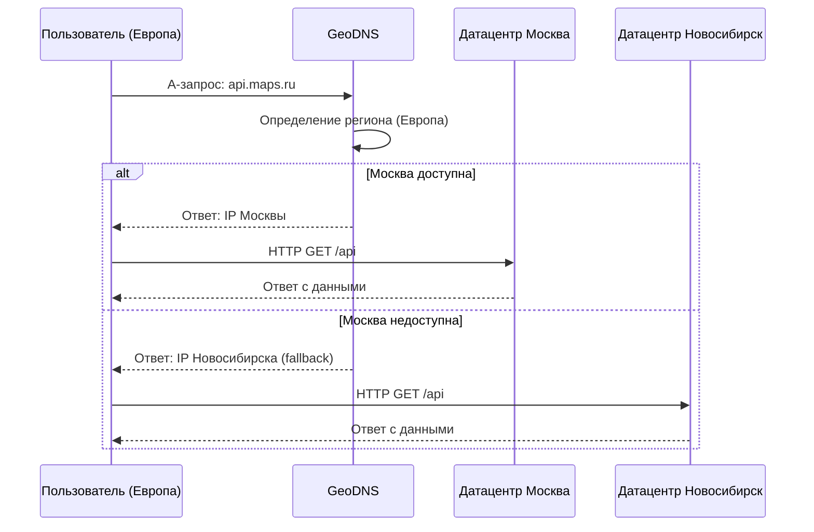
### Схема CDN балансировки
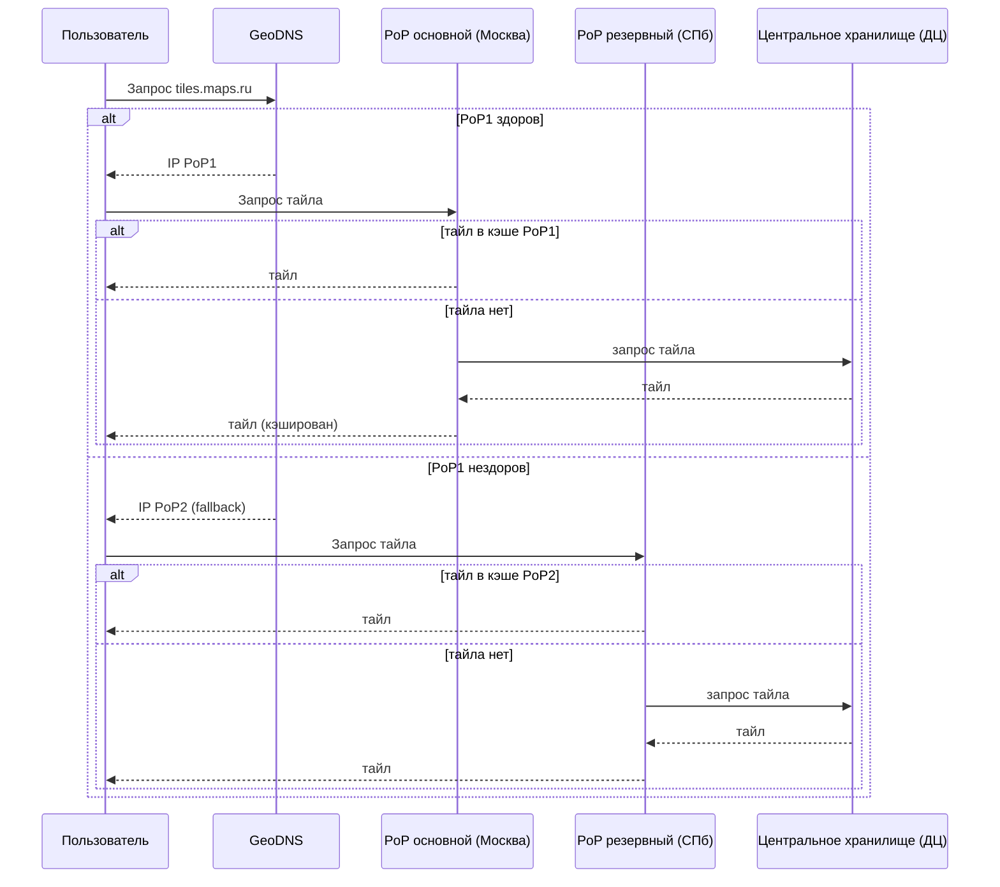

## 4. Локальная балансировка нагрузки

### Расчёт количества балансировщиков
Для определения числа балансировщиков, возьмем предложенные в материалах[13, 14](#Список-источников) референсные бенчмарки NGINX:

HTTPS RPS: 77,427 запросов/с (16 CPU, 100 Кбайт)
Пропускная способность: 8.80 Гбит/с (16 CPU)
#### PoP
Общая пиковая нагрузка на тайлы:
RPS = 284 375, трафик = 113,75 Гбит/с.
Количество PoP = 10, исходя из равномерного распределения на один PoP приходится:
RPS ≈ 28 438, трафик ≈ 11,4 Гбит/с.

Таким образом, достаточно двух балансировщиков. Используется схема резервирования N + 1, таким образом, всего L7 балансировщиков 3.

Для L4 достаточно одного узла, но для отказоустойчивости возьмем два. Схема резервирования N + 1, всего 3.

#### Датацентр
Общая пиковая нагрузка на датацентр в сценарии отказа второго:
RPS = 11 960, трафик = 18,08 Гбит/с.

Таким образом, требуется три балансировщика. Используется схема резервирования N + 1, таким образом, всего L7 балансировщиков 4.

Для L4 достаточно одного узла, но для отказоустойчивости возьмем два. Схема резервирования N + 1, всего 3.

#### Итоговая таблица количества балансировщиков
| Узел      | Тип балансировщика | Активных (N) | Резервных | Всего (N+1) |
| --------- | ------------------ | ------------ | --------- | ----------- |
| PoP       | L7                 | 2            | 1         | 3           |
| PoP       | L4                 | 2            | 1         | 3           |
| Датацентр | L7                 | 3            | 1         | 4           |
| Датацентр | L4                 | 2            | 1         | 3           |

#### Маршрутизация L7 балансировщиком
Роль L7 балансировщика выполняет Nginx Ingress Controller. Поддоменам соответствуют свои Ingress ресурсы, пулам подов бэкендов свои Service с Endpoints. Они определяют правила маршрутизации контроллером, который выполняет healthcheck подов и балансирует нагрузку между подами по алгоритму round-robin.

### Схема балансировки нагрузки
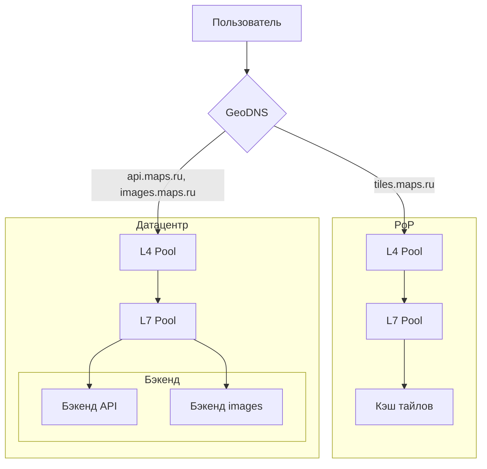

## 5. Логическая схема БД

### Основная БД
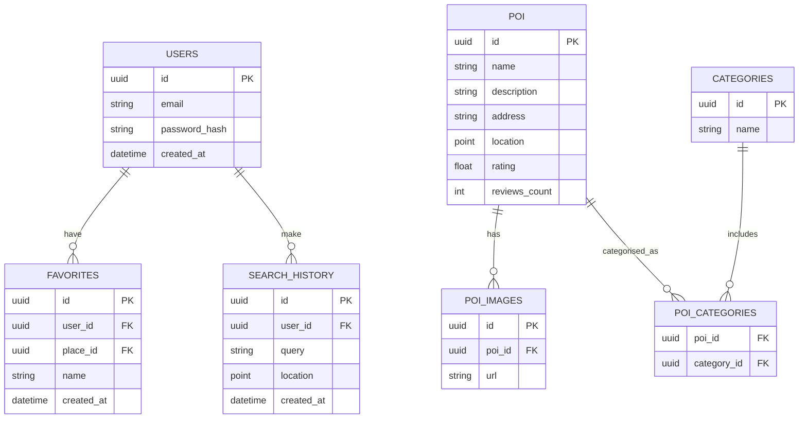
### Граф дорог
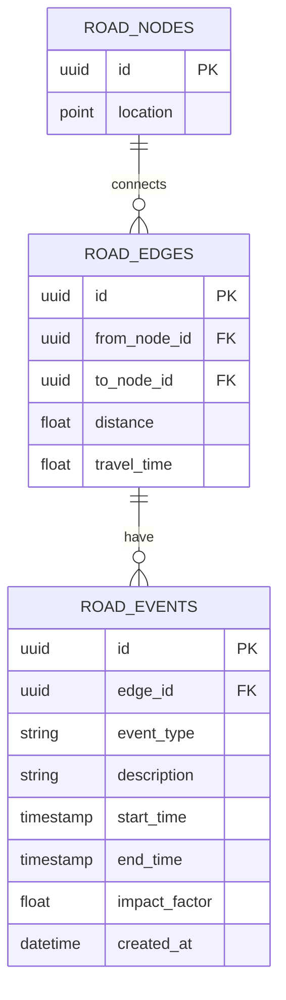

### Используемые оценки, полученные ранее

| Параметр                                          | Значение |
| ------------------------------------------------- | -------- |
| MAU                                               | 100 млн  |
| DAU                                               | 36 млн   |
| Количество организаций                            | 100 млн   |
| Изображений на организацию                        | 10       |
| Среднее количество категорий на организацию       | 2        |
| Количество зарегистрированных пользователей       | 150 млн  |
| Доля пользователей, имеющих избранное             | 50%      |
| Среднее количество избранных мест на пользователя | 10       |
| Хранение истории поиска / маршрутов               | 30 дней  |
| Узлов дорожной сети России                        | 30 млн   |
| Рёбер дорожной сети России                        | 40 млн   |

### Размеры и QPS

| Таблица          | Средний размер записи | Примерное количество записей | Общий объём | QPS peak чтение | QPS peak запись |
| ---------------- | --------------------- | ---------------------------- | ----------- | --------------- | --------------- |
| `USERS`          | 114 байт              | 150 млн                      | 17,1 ГБ     | 1 700           | 15              |
| `FAVORITES`      | 86 байт               | 750 млн                      | 64,5 ГБ     | 1 70            | 4 400           |
| `POI`            | 386 байт              | 100 млн                       | 38,6 ГБ      | 300 000         | 1 000           |
| `POI_IMAGES`     | 132 байта             | 1 млрд                      | 132 ГБ     | 2 000 000       | –               |
| `CATEGORIES`     | 46 байт               | 500                          | < 1 МБ      | 150 000         | -               |
| `POI_CATEGORIES` | 32 байта              | 200 млн                       | 6,4 ГБ     | 150 000         | –               |
| `ROAD_NODES`     | 40 байт               | 30 млн                       | 1,2 ГБ      | 1 700 000       | –               |
| `ROAD_EDGES`     | 40 байт               | 40 млн                       | 1,6 ГБ      | 1 700 000       | –               |

### Кэши и буферы

**Кэш организаций:** Для популярных организаций хранить полные объекты. 

**Кэш изображений:** Метаданные `POI_IMAGES` кэшируются, сами файлы – на S3.

**Кэш графа:** Весь граф дорог России (узлы + рёбра) можно держать в памяти, это ~3 ГБ.

### Требования к консистентности

| Таблица                            | Требование | Обоснование                                                         |
| ---------------------------------- | ---------- | ------------------------------------------------------------------- |
| `USERS`                            | Strong     | Нужна актуальность данных авторизации и изменений профиля           |
| `FAVORITES`                        | Eventual   | Допустима задержка при добавлении                                   |
| `POI`                              | Eventual   | Допустима задержка при изменении / добавлении                       |
| `POI_IMAGES`                       | Eventual   | Изображения загружаются редко, допустима задержка                   |
| `CATEGORIES`, `POI_CATEGORIES`     | Eventual   | Допустима задержка при изменении / добавлении                       |
| `ROAD_NODES`, `ROAD_EDGES`, `ROAD_EVENTS`         | Strong     | Из-за возможных изменений в доступности: аварии, ремонт, перекрытие |

### Особенности распределения нагрузки по ключам

**`POI`:** Популярные организации (Москва, Санкт-Петербург) получают в сотни раз больше запросов. 

**`POI_IMAGES`:** Запросы идут пачками на карточку.

**`FAVORITES`, `SEARCH_HISTORY` и `ROUTES_HISTORY`:** Запись по `user_id`, чтение только своей истории.

Граф дорог **(`ROAD_NODES`, `ROAD_EDGES`, `ROAD_EVENTS`):** Популярные регионы, Москва и область, Санкт-Петербург.  

## 6. Физическая схема БД

### Основная БД
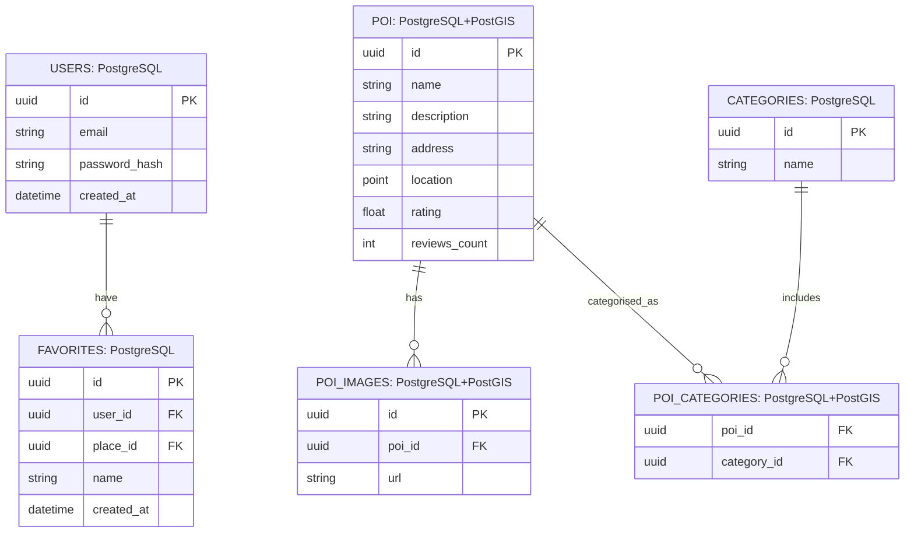
### Граф дорог
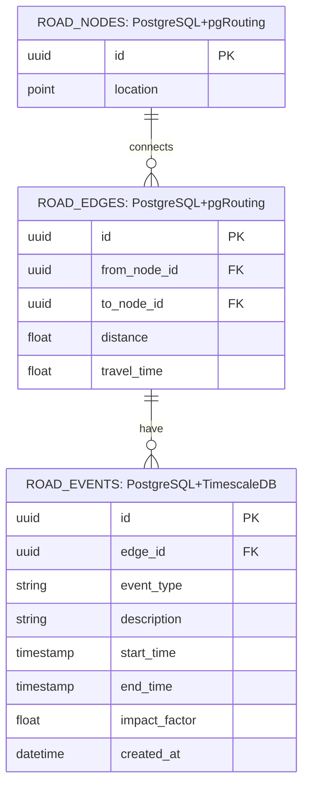

### Аргументация выбора СУБД: Почему PostgreSQL, а не специализированная графовая СУБД?

Neo4j - не реплицируется, устарела, нет пространственных индексов
ArangoDB - в первую очередь документная, графовый функционал вторичен, в сценарии графа дорог не умеет делать снаппинг на ребро
Остальные варианты недостаточно зрелые для высоконагруженного сценария

### Шардирование, репликация и резервирование

| Таблица | СУБД | Шардирование (ключ, количество шардов) | Репликация | Резервное копирование |
|----------------|------|----------------------------------------|------------|----------------------|
| `USERS` | PostgreSQL | По `user_id` | Синхронная | pg_basebackup + WAL, ежедневно |
| `FAVORITES` | PostgreSQL | Сошардено с `USERS` по `user_id` | Синхронная | pg_basebackup + WAL, ежедневно |
| `POI` | PostgreSQL + PostGIS | По `poi_id` | Асинхронная | pg_dump параллельный + WAL, каждые 6 ч |
| `POI_IMAGES` | PostgreSQL | Сошардено с `POI` по `poi_id` | Асинхронная | pg_dump параллельный |
| `POI_CATEGORIES` | PostgreSQL | Сошардено с `POI` по `poi_id` | Асинхронная | pg_dump параллельный |
| `CATEGORIES` | PostgreSQL | Нет шардирования | Синхронная | pg_dump, ежедневно |
| `ROAD_NODES` | PostgreSQL + pgRouting | Нет шардирования | Асинхронная | pg_basebackup + WAL, ежедневно |
| `ROAD_EDGES` | PostgreSQL + pgRouting | Нет шардирования | Асинхронная | pg_basebackup + WAL, ежедневно |
| `ROAD_EVENT` | PostgreSQL + TimescaleDB | Партиционирование по `start_time` | Асинхронная | pg_dump, TTL 30 дней |

### Индексы

| Таблица | Индекс (поля) | Тип индекса | Примечание |
|---------|---------------|-------------|-------------|
| `USERS` | `email` | UNIQUE B-tree | Для быстрого поиска по email при логине |
| `FAVORITES` | `user_id, created_at` | B-tree | Для пагинации списка избранного пользователя |
| `FAVORITES` | `user_id, place_id` | UNIQUE B-tree | Защита от дублирования избранного |
| `POI` | `location` | GIST (PostGIS) | Пространственный поиск |
| `POI` | `name` | GIN (trigram) | Полнотекстовый поиск по названию (ILIKE / @@) |
| `POI` | `rating` | B-tree (DESC) | Сортировка по рейтингу в выдаче |
| `POI_IMAGES` | `poi_id` | B-tree | Для получения всех изображений организации |
| `POI_IMAGES` | `poi_id, url` | UNIQUE B-tree | Уникальность URL для одной организации |
| `CATEGORIES` | `name` | UNIQUE B-tree | Поиск категории по имени |
| `POI_CATEGORIES` | `poi_id` | B-tree | Для получения категорий организации |
| `POI_CATEGORIES` | `category_id` | B-tree | Для обратного поиска (все POI в категории) |
| `POI_CATEGORIES` | `poi_id, category_id` | UNIQUE B-tree | Защита от дублирования связей |
| `ROAD_NODES` | `location` | GIST (PostGIS) | Поиск ближайшего узла к точке |
| `ROAD_EDGES` | `from_node_id` | B-tree | Для построения маршрута (исходящие рёбра) |
| `ROAD_EDGES` | `to_node_id` | B-tree | Для обратного поиска (входящие рёбра) |
| `ROAD_EDGES` | `(from_node_id, to_node_id)` | B-tree | Ускорение запросов на наличие ребра |
| `ROAD_EVENT` | `edge_id, start_time` | B-tree | Для получения активных событий на ребре |
| `ROAD_EVENT` | `start_time, end_time` | B-tree | Для очистки устаревших событий (TTL) |
| `ROAD_EVENT` | `(edge_id) WHERE now() BETWEEN start_time AND end_time` | Partial B-tree | Частичный индекс для активных событий |

### Балансировка запросов и мультиплексирование подключений
Происходит с помощью sidecar pgBouncer, распределяющего запросы и управлящего пулом соединений.

Для снижения нагрузки на БД и балансировки запросов используется Redis.

- **Кэш горячих объектов** – карточки популярных POI, результаты частых поисковых запросов.
- **Сессии и rate limiting** – хранение пользовательских сессий (для L7 балансировщиков) и счётчиков для лимита запросов (token bucket).
- **In‑memory граф для маршрутизации** – кэширование части дорожного графа для быстрых расчётов.

## 7. Алгоритмы

| Алгоритм | Область применения | Детальное описание |
|----------|--------------------|--------------------|
| **A\* на графе** | Построение маршрута (навигация) | Алгоритм поиска кратчайшего пути на взвешенном графе дорог. Использует эвристику для ускорения. Рёбра графа взвешены по `travel_time` (с учётом статической скорости, пробок и событий). Применяется в связке с pgRouting или in‑memory реализацией. |
| **Dijkstra (модифицированный)** | Построение зон достижимости | Расчёт всех точек, достижимых из старта за заданное время. Используется для показа области "10 минут пешком/на машине". |
| **Haversine + геохэш** | Поиск организаций "рядом" | Быстрое предварительное фильтрование POI по геохэшу, затем точное вычисление расстояния по формуле гаверсинусов для ранжирования. Применяется в API. |
| **TF‑IDF / BM25 (с триграммами)** | Полнотекстовый поиск по названиям организаций | Индексирование названий и адресов. BM25 даёт ранжирование по релевантности. Для русскоязычного поиска используется морфологическая нормализация (стемминг) и триграммы для устойчивости к опечаткам. |
| **Геометрическая кластеризация (grid + k‑means)** | Агрегация тайлов для зумов 5–12 | При удалении карты множество точек POI объединяются в кластеры. Сначала сеточное разбиение (по тайлам зума 8), затем внутри каждой ячейки – k‑means для равномерного распределения меток. Результат кэшируется в тайлах. |
| **LRU (Least Recently Used)** | Кэширование на CDN PoP | Вытеснение наименее востребованных объектов из кэша. Применяется для: тайлов карт, карточек организаций. |
| **Round‑robin / Least connections** | Балансировка L4 и L7 | L4 балансировщик (LVS) распределяет TCP-потоки по активным L7-узлам методом round‑robin. L7 (HAProxy) между подами бэкенда – least connections (предпочтительнее для длительных запросов, например, загрузка изображений). |
| **Geohash prefix tree (geotrie)** | Ускорение обратного геокодирования | Поиск названия ближайшей улицы или района по координатам. Строится префиксное дерево (trie) по геохэшам разной длины. При запросе геохэш точки уточняется, спускаясь по дереву до максимального совпадения. |
| **Алгоритм косинусного сходства (cosine similarity)** | Рекомендация похожих мест | На основе категорий, среднего чека, отзывов строится вектор организации. Для текущей карточки вычисляются топ‑5 ближайших по косинусному расстоянию. Используется в блоке «Смотрите также». |

## 8. Технологии

| Технология | Область применения | Мотивационная часть |
|------------|--------------------|---------------------|
| **Kubernetes** | Оркестрация бэкендов (API, images, маршрутизация) | Автоматическое масштабирование, yпрощает управление микросервисами и инфраструктурой, позволяет выдерживать пиковые нагрузки. |
| **NGINX Ingress Controller** | L7 балансировка в Kubernetes | Стандартный контроллер для K8s. Следит за Ingress‑ресурсами, динамически обновляет конфигурацию, интегрируется с сервис‑дискавери. |
| **PostgreSQL** | Основная реляционная БД (пользователи, избранное, POI, категории) | Обеспечивает ACID, мощные расширения, поддерживает шардирование и репликацию, включая географическую. |
| **PgBouncer** | Пул соединений к PostgreSQL | Лёгкий менеджер пулов. Удерживает тысячи клиентских подключений, мультиплексируя их в ограниченное число постоянных соединений с БД. Защищает БД от лавины соединений. |
| **PostGIS** | Геопространственные данные (POI, дорожные узлы) | Расширение PostgreSQL для пространственных запросов, стандарт среди открытого ПО. Индексы GIST, функции расстояния, пересечения, геохэши. |
| **pgRouting** | Построение маршрутов, изохроны | Расширение PostgreSQL для графовых алгоритмов (Dijkstra, A*, TSP). Позволяет выполнять маршрутизацию прямо в БД без отдельной графовой СУБД. |
| **TimescaleDB** | Хранение временных событий (ROAD_EVENT) | Автоматическое партиционирование по времени, сжатие, TTL. Оптимизировано для high‑frequency вставок и эффективных запросов по интервалам. |
| **Redis** | Кэш горячих объектов, сессии, rate limiting, буферизация записи | In‑memory хранилище с микросекундными задержками. Критичен для снижения нагрузки на БД. |
| **Ceph** | Хранение тайлов карт и изображений POI | Масштабируемое объектное хранилище. Позволяет обслуживать большие объёмы статики. |
| **Varnish** | Кэширование тайлов, эффективное управление кэшем (LRU, TTL). Позволяет разгрузить Ceph и ускорить отдачу. |
| **Prometheus + Grafana** | Мониторинг и визуализация метрик | Сбор метрик (QPS, задержки, ошибки, использование ресурсов), алертинг. Позволяет быстро диагностировать проблемы и планировать масштабирование. |

## 9. Обеспечение надежности

| Компонент | Механизм / Технология |
|-----------|----------------------|
| **Дата‑центр (Москва, Новосибирск)** | Гео‑распределение: оба ДЦ активны, каждый обслуживает свой регион. При отказе одного — GeoDNS перенаправляет API‑трафик на работающий ДЦ (с возможной деградацией функций). |
| **L4 балансировщик (ДЦ)** | Горизонтальное масштабирование, 3 узла (2 активных + 1 резервный). |
| **L7 балансировщик (ДЦ)** | Горизонтальное масштабирование, 4 узла (3 активных + 1 резервный). |
| **Kubernetes control plane** | Кластер из 3+ мастеров, etcd (Raft). |
| **Бэкенд‑сервисы** | Горизонтальное масштабирование 2+ реплик, HPA по RPS. Kubernetes перезапускает или создаёт новые поды при падении. |
| **PostgreSQL** | Для критичных данных синхронная репликация 2+1 с автоматическим failover. Для остальных данных асинхронная репликация мастера на реплику, географическое шардирование, реплики для чтения. |
| **Redis** | Кластер Sentinel: 3 мастера + 3 реплики, распределение ключей по хэш‑кольцу. |
| **Объектное хранилище (Ceph)** | Distributed Ceph (8+ узлов, erasure code 4+4); допускает отказ до 4 узлов. Репликация данных по зонам. |
| **Origin Varnish** | Кластер из 3 узлов (2 активных + 1 резервный). Агрегирует запросы к Ceph, снижает нагрузку на хранилище. |
| **CDN / PoP (тайлы, изображения)** | 10 независимых PoP по РФ. При отказе одного PoP — DNS направляет пользователей на другой. |
| **L4 балансировщик (PoP)** | Горизонтальное масштабирование, 3 узла (2 активных + 1 резервный). |
| **L7 балансировщик (PoP)** | Горизонтальное масштабирование, 3 узла (2 активных + 1 резервный). |
| **Edge Varnish (PoP)** | Все кэш‑серверы активны; при отказе одного трафик перенаправляется L7 на оставшиеся. Синхронизация кэша с Ceph. |

## 10. Схема проекта

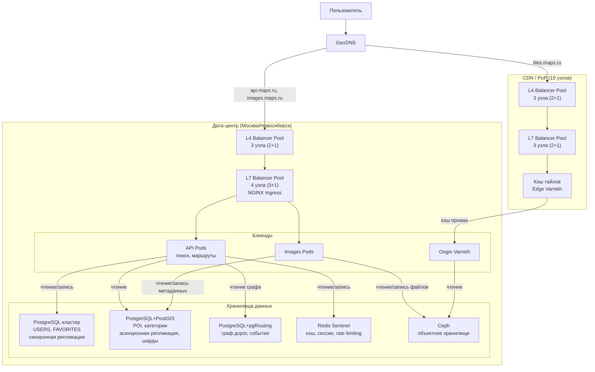

### Потоки данных

#### Поток запроса тайлов

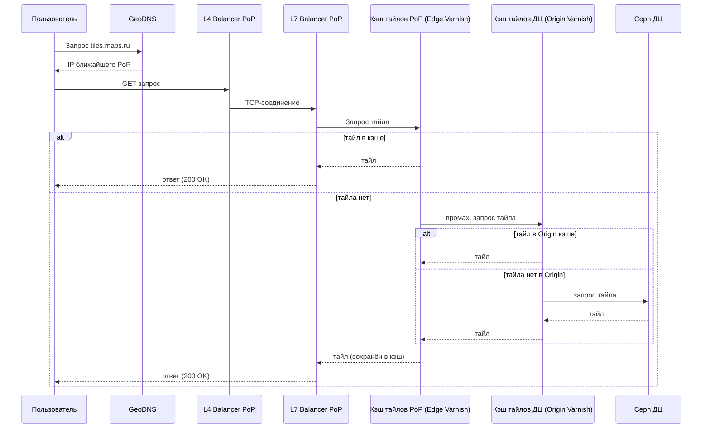

#### Поток API запроса, поиск организации

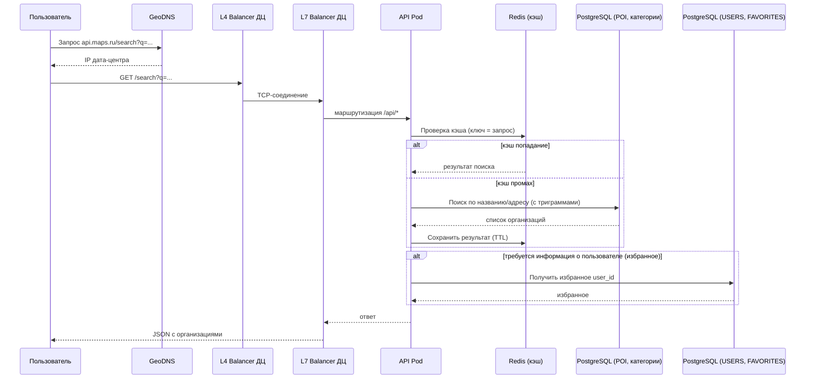

#### Поток построения маршрута

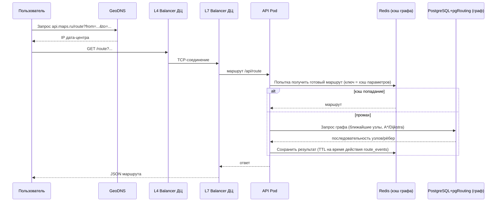

#### Поток получения изображения организации

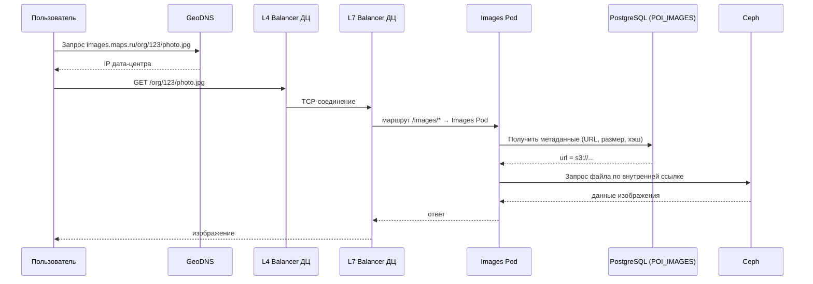

## 11. Список серверов

### Кластер PoP

| Компонент (Pod) | Реплики (min/max) | CPU (запрос/лимит) | RAM (запрос/лимит) | Диск (PVC) | Примечание |
|----------------|------------------|--------------------|--------------------|------------|-------------|
| **L4 Balancer** (MetalLB) | 3 (2+1) | 2 / 4 ядра | 4 / 8 ГБ | 20 ГБ | BGP/ECMP, приём трафика `tiles.maps.ru` |
| **L7 Balancer** (NGINX Ingress) | 3 (2+1) | 4 / 8 ядер | 8 / 16 ГБ | 50 ГБ | Edge‑кэш тайлов, SSL‑терминация |
| **Edge Cache** (Varnish) | 3 (все активны) | 8 / 16 ядер | 32 / 64 ГБ | 100 ТБ | Хранение горячих тайлов (LRU). Параметры могут быть выше для ключевых PoP. |

### Кластер дата-центра

| Компонент (Pod) | Реплики (min/max) | CPU (запрос/лимит) | RAM (запрос/лимит) | Диск (PVC) | Примечание |
|----------------|------------------|--------------------|--------------------|------------|-------------|
| **Балансировщики** |||||
| L4 Balancer (MetalLB) | 3 (2+1) | 4 / 8 ядер | 8 / 16 ГБ | 50 ГБ | Приём `api.maps.ru`, `images.maps.ru` |
| L7 Balancer (NGINX Ingress) | 4 (3+1) | 8 / 16 ядер | 16 / 32 ГБ | 100 ГБ | SSL termination, маршрутизация по URL |
| Origin Varnish | 3 (2+1) | 16 / 32 ядра | 32 / 64 ГБ | 2 ТБ | Кэш второго уровня для тайлов |
| **Бэкенды** |||||
| API Pod (поиск, маршруты) | 4 / 8 | 4 / 8 ядер | 8 / 16 ГБ | – | HPA по RPS/CPU |
| Images Pod | 8 / 16 | 2 / 4 ядра | 4 / 8 ГБ | – | Метаданные, прокси Ceph |
| **PostgreSQL** |||||
| Master | 1 | 32 / 64 ядра | 128 / 256 ГБ | 2 ТБ | Все записи |
| Sync replica | 2 | 32 / 64 ядра | 128 / 256 ГБ | 2 ТБ | Синхронная репликация |
| Async replica (чтение) | 3 | 32 / 64 ядра | 128 / 256 ГБ | 2 ТБ | Балансировка чтения |
| Шарды POI – 32 шарда | 32 × (master+replica) | 16 / 32 ядра | 64 / 128 ГБ | 1 ТБ | Географическое шардирование |
| PgBouncer (sidecar) | 1 на каждый под | 0.5 / 1 ядро | 1 / 2 ГБ | – | Пул соединений к PostgreSQL |
| **Redis кластер** |||||
| Redis master | 3 | 8 / 16 ядер | 32 / 64 ГБ | 200 ГБ (AOF/RDB) | Хэш‑кольцо |
| Redis replica | 3 | 8 / 16 ядер | 32 / 64 ГБ | 200 ГБ | Автоматический failover |
| **Ceph объектное хранилище** |||||
| Ceph pods | 20 | 40 / 80 ядер | 80 / 160 ГБ | 200 ГБ |  |
| **Мониторинг и логирование** |||||
| Prometheus | 2 | 8 / 16 ядер | 32 / 64 ГБ | 1 ТБ | Федерация метрик |
| Grafana | 2 | 4 / 8 ядер | 8 / 16 ГБ | 100 ГБ | Дашборды |
| Alertmanager | 3 | 2 / 4 ядра | 4 / 8 ГБ | 50 ГБ | Алерты |

## Список источников
1. https://ir.yandex.ru/financial-releases (Q3 2025, Финансовый отчет МКПАО Яндекс)
2. https://abc.xyz/investor/events/event-details/2024/2024-q3-earnings-call/ (Q3 2024, Финансовый отчет Alphabet)
3. https://info.2gis.ru/novosibirsk/ (2025, Официальный сайт 2ГИС)
4. https://www.wallstreetprep.com/knowledge/product-stickiness/
5. https://yandex.ru/project/maps/app_download
6. https://ria.ru/20250226/goroda-1832007799.html
7. https://www.rbc.ru/life/news/65fbfb259a7947623baacfae
8. https://yandex.ru/companяy/news/23-12-2025-02
9. https://yandex.ru/maps-api/docs/tiles-api/index.html?utm_campaign=links&utm_content=api-translate&utm_source=emailing
10. https://download.geofabrik.de/
11. https://yandex.ru/maps-api/products/geosearch-api?utm_campaign=links&utm_content=api-translate&utm_source=emailing&lang=ru
12. https://xn--80apggvco.xn--p1ai/chislennost-naseleniya-rossii-po-regionam-2025
13. https://blog.nginx.org/blog/testing-performance-nginx-ingress-controller-kubernetes
14. https://blog.nginx.org/blog/testing-the-performance-of-nginx-and-nginx-plus-web-servers